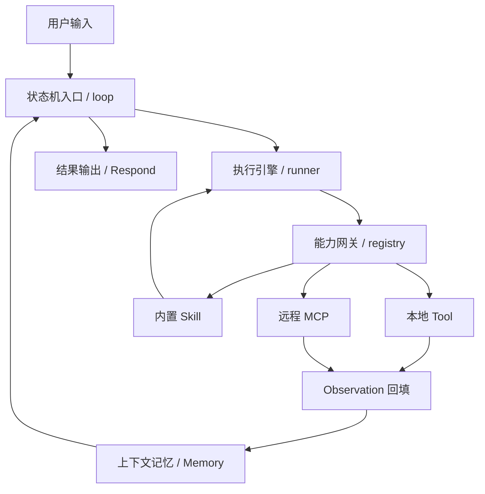
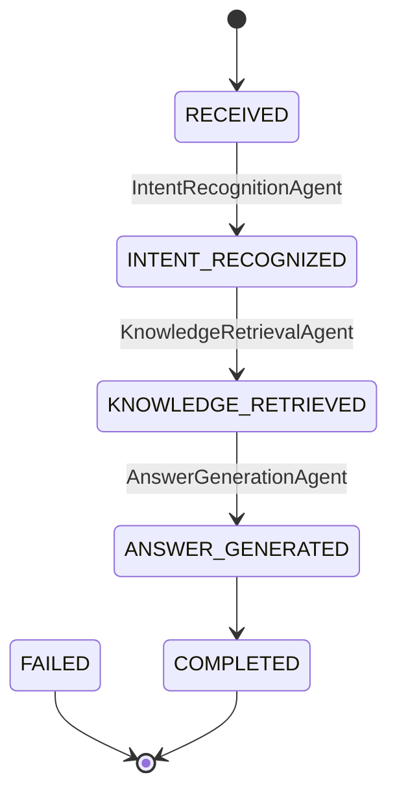
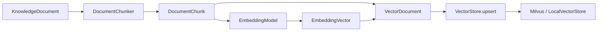
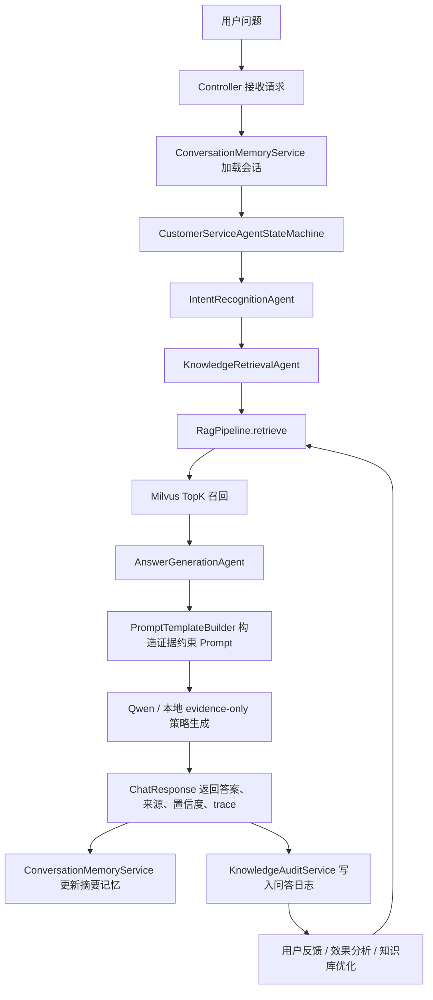

# Nanobot Runtime 对标与企业知识库智能问答系统技术说明

本文档用于重新组织答辩第三页之后的技术叙事。主项目建议统一命名为：

**基于多 Agent 与 RAG 的企业知识库智能问答系统**

不要把主项目讲成简单的“智能客服 demo”，也不要把重点放在“AI Coding Agent”这个名字上。当前项目可以拆成两层理解：

- `com.wenhui.agent`：参考 Nanobot / OpenClaw 思想实现的 Agent Runtime 骨架验证层。
- `reference-service`：真正用于答辩展开的企业知识库智能问答业务系统。

一句话主线：

> 我参考 Nanobot / OpenClaw 式 Agent Runtime 的闭环思想，将“状态调度、执行引擎、能力路由、上下文记忆、结果治理”迁移到 Java 企业知识库智能问答系统中，并通过多 Agent 编排、RAG 检索、Milvus 向量库、Qwen 生成、Redis 会话记忆和 MySQL 审计日志形成一个可追踪、可迭代的 AI 应用落地链路。

## 1. Nanobot / OpenClaw 的闭环思想

可以按这张闭环去讲：



这套思想的关键不是“一次调用大模型”，而是一个循环：

- 状态机负责判断任务处于哪个阶段、是否继续执行、是否结束。
- Runner 负责组织模型推理、工具调用、Observation 回填，也就是 ReAct 的“思考、行动、观察、再思考”。
- Registry 负责把不同能力统一成可被 Agent 调度的能力目录。
- Memory 负责保存近期上下文、摘要记忆和关键状态。
- Respond / Governance 负责把最终答案、来源、日志和反馈记录下来。

答辩里不要把 Nanobot 讲成“我完整复刻了它”，更准确的说法是：

> Nanobot 给我的价值在于，它用较轻量的代码展示了 Agent Runtime 的主路径。我做的是先拆解这个闭环，再把它迁移到 Java 企业知识库智能问答场景里。

## 2. Nanobot 到本项目的代码映射

| Nanobot / OpenClaw 概念 | 我项目里的 Runtime 骨架                                         | 我项目里的业务系统落点                                                                                                                   | 答辩讲法                                  |
| --------------------- | -------------------------------------------------------- | ----------------------------------------------------------------------------------------------------------------------------- | ------------------------------------- |
| loop / 状态机入口          | `CodingAgentRuntime.execute()`、`TaskScheduler`           | `CustomerServiceAgentStateMachine`、`AgentState`                                                                               | 用状态机控制任务生命周期和 Agent 流转                |
| runner / 执行引擎         | `AgentPolicy`、`RuleBasedAgentPolicy`、`ToolRouter.call()` | `KnowledgeCustomerService.chat()` 串起完整业务链路                                                                                    | 不是单次请求，而是多阶段执行闭环                      |
| registry / 能力网关       | `ToolRouter`、`ToolRegistryFactory`、`ToolSpec`            | `KnowledgeRepository`、`VectorStore`、`PromptAnswerGenerator`、`ConversationMemoryStore`、`KnowledgeAuditRepository`              | 把模型背后的业务能力抽象成可替换接口                    |
| local tool            | `create_workspace`、`read_file`、`run_command` 等本地工具       | 知识检索、问答日志、会话记忆等业务能力                                                                                                           | 本地 Tool 思想在 Runtime 层已完整体现            |
| built-in skill        | 当前 Runtime 层未做 `SKILL.md` 动态加载                           | `PromptTemplateBuilder`、`GroundedPrompt`、`enterprise-kb-grounded-v1`                                                          | 将 Skill 的“内置策略注入”迁移为版本化 Prompt 策略     |
| remote MCP            | 当前未做 MCP 协议级接入                                           | `MilvusSdkVectorStore`、`OpenAiCompatibleAnswerGenerator`、`RedisConversationMemoryStore`、`MyBatisPlusKnowledgeAuditRepository` | 将 MCP 的“外部能力接入”迁移为接口适配器，后续可包装成 MCP 工具 |
| Observation           | `AgentObservation`、`TaskContext.observations()`          | `AgentContext.trace()`、`ChatResponse.trace()`                                                                                 | 每一步执行结果都回填上下文，便于下一步决策和排查              |
| Memory                | `TaskContext` 保存文件缓存、工具调用、决策日志                           | `ConversationSessionState`、`ConversationMemoryService`、Redis Store                                                            | 支持多轮追问、摘要记忆和状态延续                      |
| Governance            | `TaskScheduler.finalize()`、校验命令                          | `Prompt` 证据约束、置信度阈值、QA 日志、用户反馈                                                                                                | 让答案有依据、可追踪、可复盘                        |

## 3. Tool、Skill、MCP 在本项目里的体现

这个问题面试官很可能追问，建议用“已实现 + 思想映射 + 预留扩展”的方式讲。

### 3.1 本地 Tool：已在 Runtime 层完整实现

代码位置：

- `src/main/java/com/wenhui/agent/tool/ToolSpec.java`
- `src/main/java/com/wenhui/agent/tool/ToolRouter.java`
- `src/main/java/com/wenhui/agent/tool/ToolRegistryFactory.java`

实现方式：

- `ToolRegistryFactory.create()` 注册本地工具。
- 每个工具有 `ToolSpec`，包括名称、描述、必填参数、权限域。
- `ToolRouter.call()` 根据工具名找到 handler，检查参数后执行。
- 工具执行结果封装成 `ToolCall`，再由 `TaskScheduler.recordObservation()` 写入 `TaskContext.observations()`。

当前本地工具包括：

- `create_workspace`：创建隔离工作区。
- `list_files`：查看文件列表。
- `search_code`：搜索代码。
- `read_file`：读取文件。
- `write_file`：写入文件。
- `draft_change_set`：根据上下文生成变更方案。
- `run_command`：执行验证命令。

答辩讲法：

> 在 Nanobot 里，本地 Tool 是被 Registry 注册后供 Runner 调用的。我在 Java Runtime 骨架里也做了类似设计，用 `ToolSpec` 描述工具，用 `ToolRouter` 做路由，用 `ToolCall` 和 `Observation` 回填执行结果。这部分对应的是 Agent 背后可以操作本地工程能力的最小闭环。

### 3.2 内置 Skill：没有做动态 SKILL.md，做了业务化 Prompt Skill

Nanobot 的 Skill 更像是在构建阶段把某类能力说明注入 system prompt，影响模型后续推理和工具选择。

本项目没有做成动态读取 `SKILL.md` 的形式，但做了业务化迁移：

- `PromptTemplateBuilder`：构造系统指令、用户问题、会话摘要、证据块和输出策略。
- `GroundedPrompt`：保存结构化 prompt，包括版本号、证据、输出策略和来源文档。
- `PromptConstrainedAnswerGenerator` / `OpenAiCompatibleAnswerGenerator`：执行 evidence-only 策略。
- Prompt 版本号：`enterprise-kb-grounded-v1`。

答辩讲法：

> 这一块我没有硬做一个 `SKILL.md` 文件加载器，而是把 Skill 的思想落到了企业问答的 Prompt 策略里。也就是说，系统内置了一个“基于知识证据回答”的业务 Skill：它会把 session summary、resolved question、retrieved evidence 和 output policy 组合成结构化 prompt，约束模型只能基于证据回答。

### 3.3 远程 MCP：当前不是协议级 MCP，而是外部能力适配层

Nanobot 的远程 MCP 是连接外部 MCP Server，通过 `list_tools` 拿到工具 schema，再包装成 `mcp_xxx` 工具供 Runner 调用。

本项目目前没有实现 MCP 协议级接入，不能在答辩里说“我已经完整接入 MCP”。但本项目已经实现了 MCP 思想里最重要的工程点：外部能力通过统一接口解耦。

外部能力适配代码：

- Milvus 向量库：`VectorStore`、`MilvusSdkVectorStore`、`VectorStoreFactory`
- Qwen / DashScope 模型：`OpenAiCompatibleAnswerGenerator`、`OpenAiCompatibleEmbeddingModel`
- Redis 会话记忆：`ConversationMemoryStore`、`RedisConversationMemoryStore`
- MySQL 审计日志：`KnowledgeAuditRepository`、`MyBatisPlusKnowledgeAuditRepository`

答辩讲法：

> 对 MCP 我会比较诚实地说，目前项目没有做协议级 MCP Server 接入，而是先把外部能力抽象成可替换的 Adapter。例如向量库通过 `VectorStore` 切换本地和 Milvus，模型通过 OpenAI-compatible Adapter 接入 Qwen，Redis 和 MySQL 也通过 Store / Repository 接口接入。后续如果要补 MCP，只需要把这些能力包装成 MCP Tool schema，再挂到 Registry 上。

这句话很重要：

> 我没有为了 PPT 硬造一个假的 MCP，而是先把外部能力解耦成接口适配器，这是工程落地里更关键的一步。

## 4. 项目文件夹结构

项目根目录：

`D:\interview\华子\ai-coding-agent-java`

### 4.1 Runtime 骨架层：`src/main/java/com/wenhui/agent`

这一层是对 Nanobot Runtime 思想的 Java 骨架验证。

```text
src/main/java/com/wenhui/agent
├── domain      # Runtime 上下文、工具调用、状态、Observation 等领域对象
├── runtime     # Agent loop、调度器、策略层
├── tool        # ToolSpec、ToolRouter、本地工具注册、隔离工作区
└── web         # Spring Boot 入口和 Runtime API
```

核心类：

- `CodingAgentRuntime`：Agent Runtime 主循环。
- `TaskScheduler`：状态更新、失败重试、终止判断。
- `AgentPolicy`：策略接口，后续可替换为 LLM Policy。
- `RuleBasedAgentPolicy`：当前规则策略，用于验证闭环。
- `ToolRouter`：能力路由网关。
- `ToolRegistryFactory`：注册本地工具。
- `TaskContext`：Runtime 执行上下文。
- `AgentObservation`：工具执行结果回填。

这一层适合在 PPT 第三页讲：我不是只看 Nanobot，而是用 Java 复现了它的 Runtime 主路径。

### 4.2 业务系统层：`reference-service/src/main/java/com/wenhui/reference`

这一层是答辩主项目。

```text
reference-service/src/main/java/com/wenhui/reference
├── agent       # 多 Agent、状态机、业务上下文
├── rag         # 文档切分、Embedding、向量库、TopK 召回
├── llm         # Qwen / DashScope / OpenAI-compatible 模型适配
├── prompt      # 结构化 prompt、证据约束、输出策略
├── memory      # 多轮会话上下文、摘要记忆、Redis 适配
├── persistence # 文档元数据、问答日志、用户反馈、MyBatis-Plus 适配
├── model       # 请求、响应、知识文档、知识片段等领域模型
├── config      # Spring Bean 配置和环境变量切换
└── web         # REST 接口
```

建议答辩主线聚焦这一层。

## 5. 多 Agent 状态机调度

业务入口：

- `CustomerServiceController.chat()`
- `KnowledgeCustomerService.chat()`

核心状态机：

- `CustomerServiceAgentStateMachine`
- `AgentState`
- `AgentContext`

状态流转：



代码实现方式：

- `CustomerServiceAgentStateMachine` 用 `EnumMap<AgentState, Agent>` 保存状态到 Agent 的映射。
- `run()` 方法里用 `while` 循环推动状态前进。
- 每个 Agent 只负责一个阶段的职责，执行完后调用 `context.moveTo(nextState)`。
- `AgentContext` 在多个 Agent 之间传递问题、意图、召回结果、prompt、答案和 trace。

三个业务 Agent 分工：

| Agent | 代码位置 | 负责什么 | 输入 | 输出 |
| --- | --- | --- | --- | --- |
| 意图识别 Agent | `IntentRecognitionAgent` | 判断问题属于售后、知识问答，或延续上一轮意图 | `resolvedQuestion`、会话状态 | `IntentResult` |
| 知识检索 Agent | `KnowledgeRetrievalAgent` | 根据问题和意图从 RAG 知识库召回 TopK 片段 | 问题、意图 | `retrievedChunks` |
| 答案生成 Agent | `AnswerGenerationAgent` | 构造 grounded prompt，调用本地策略或 Qwen，生成答案或拒答 | 召回证据、置信度、会话摘要 | `ChatResponse` |

答辩讲法：

> 我没有把所有逻辑塞进一个 service 方法，而是拆成三个 Agent。这样做的好处是每个 Agent 职责清晰，状态可观察，后续也容易替换。例如意图识别可以从规则升级成分类模型，知识检索可以从本地向量库切到 Milvus，答案生成可以从本地 evidence-only 策略切到 Qwen。

## 6. RAG 是怎么实现的

RAG 不是只在答案生成时拼 prompt，而是分成离线入库和在线召回两部分。

### 6.1 当前知识库从哪里来

你问得很关键：知识库数据从哪里来，向量召回到底召回的是什么？

当前项目有两类知识来源。第一类是启动时的种子知识文档，用来保证系统本地启动后就能跑通问答主链路，代码在：

- `RagKnowledgeRepository.seedDocuments()`

种子文档包括：

- `DOC-001 Refund policy`
- `DOC-002 Enterprise knowledge base`
- `DOC-003 Manual review`

这些文档不是直接写死成答案，而是会真正走一遍 RAG 入库流程：

```text
seedDocuments
  -> DocumentChunker.chunk()
  -> EmbeddingModel.embed()
  -> VectorStore.upsert()
  -> Milvus collection: enterprise_knowledge_chunks
```

第二类是真实 Markdown 文档入库校验，代码在：

- `ReferenceServiceDocumentUploadChecks`

这条校验会把 `docs/nanobot-runtime-mapping-and-project-guide.md` 解析为 `KnowledgeDocument`，复用同一条 `RagPipeline.ingest()` 链路写入 Milvus，再用问题触发 TopK 召回。当前还没有做上传页面，但后端入库链路已经按真实文档跑通过。

所以面试官问“知识库怎么召回”，可以这样答：

> 当前版本有启动种子文档和真实 Markdown 文档入库两种验证方式。种子文档用于保证系统启动后具备基础知识库；真实文档入库校验用于验证外部文档可以被切分、向量化、写入 Milvus 并参与 TopK 召回。在线问答时，用户问题也会做 Embedding，再到 Milvus 里按语义相似度和 intent filter 召回证据片段。上传页面还没做，但后端入库链路已经抽象为 `RagPipeline.ingest()`，文件解析成 `KnowledgeDocument` 后即可复用。

### 6.2 离线入库链路

核心代码：

- `RagKnowledgeRepository.seeded()`
- `RagPipeline.ingest()`
- `DocumentChunker`
- `EmbeddingModel`
- `VectorStore`
- `MilvusSdkVectorStore.upsert()`

流程：



实现细节：

- `DocumentChunker(36, 6)`：按词切分，每个 chunk 最多 36 个词，重叠 6 个词。
- `EmbeddingModel`：抽象向量化模型。
- `HashingEmbeddingModel`：本地可跑的向量化实现。
- `OpenAiCompatibleEmbeddingModel`：预留 Qwen / DashScope compatible embedding 接口。
- `VectorStoreFactory`：根据配置选择 `LocalVectorStore` 或 `MilvusSdkVectorStore`。
- `MilvusSdkVectorStore.ensureCollection()`：创建 Milvus collection、字段和向量索引。
- `MilvusSdkVectorStore.upsert()`：写入 chunk_id、document_id、title、intent_name、content、embedding。

### 6.3 在线召回链路

核心代码：

- `KnowledgeRetrievalAgent.execute()`
- `RagKnowledgeRepository.search()`
- `RagPipeline.retrieve()`
- `MilvusSdkVectorStore.search()`

流程：

```text
用户问题
  -> ConversationSessionState.resolveQuestion()
  -> IntentRecognitionAgent 得到 intentName
  -> KnowledgeRetrievalAgent 调用 repository.search(query, intentName, 3)
  -> EmbeddingModel.embed(query)
  -> MilvusSdkVectorStore.search(queryVector, intentName, topK)
  -> 按 intent_name 过滤 + 向量相似度 TopK
  -> 返回 KnowledgeChunk 列表
```

Milvus 搜索时会：

- 使用向量字段 `embedding` 做 ANN 检索。
- 使用 `intent_name == "<intent>"` 做业务过滤。
- 返回 `chunk_id`、`document_id`、`title`、`content`。
- 将结果转换成 `KnowledgeChunk`，交给答案生成 Agent。

### 6.4 当前实际跑通状态

当前已经跑通：

- Milvus Docker 服务。
- Java Milvus SDK 连接。
- Collection 创建与 upsert。
- TopK 向量召回。
- Qwen Chat 生成。
- API trace 中可看到 `prompt_policy:llm_evidence_only:qwen3.7-plus`。

需要诚实说明：

- 目前已经接入 Qwen Chat。
- Embedding 当前稳定验证时使用 `HashingEmbeddingModel`。
- `OpenAiCompatibleEmbeddingModel` 已经写好，可以切换 DashScope text embedding。
- 之前给的 vision embedding 模型不适合文本知识库召回，文本知识库应该使用 text embedding 模型。

面试回答口径：

> 这个版本里，Milvus 和 Qwen Chat 已经跑通；Embedding 层我做了接口抽象，当前为了稳定演示使用本地 HashingEmbeddingModel 验证入库和召回链路，同时保留了 OpenAI-compatible Embedding 适配器。这样 RAG 的工程链路是完整的，后续替换成 text-embedding-v4 这类真实文本 embedding 模型时，不需要改状态机和 Agent 编排，只需要改配置。

## 7. 上下文存在哪里，压缩怎么做

本项目有两类上下文。

### 7.1 Runtime 层上下文

代码位置：

- `TaskContext`

保存内容：

- `request`：用户任务。
- `status`：任务状态。
- `workspacePath`：隔离工作区。
- `repoFiles` / `targetFiles`：文件观察结果。
- `fileCache`：读取过的文件内容。
- `updatedFiles`：计划写入的文件。
- `decisionLog`：每一步决策。
- `toolCalls`：工具调用记录。
- `observations`：工具执行结果。

这对应 Nanobot 的 Observation / Memory：

> 工具执行后不是直接结束，而是把结果放回 `TaskContext`，下一轮策略会基于这些 Observation 决定继续读文件、写文件还是执行验证。

### 7.2 业务层上下文

代码位置：

- `AgentContext`
- `ConversationSessionState`
- `ConversationMemoryService`
- `ConversationMemoryStore`
- `RedisConversationMemoryStore`

`AgentContext` 是一次请求在多个 Agent 之间流转的短期上下文，保存：

- 原始请求。
- resolved question。
- intent。
- retrieved chunks。
- prompt。
- prompt policy decision。
- response。
- trace。

`ConversationSessionState` 是跨多轮会话保存的长期状态，保存：

- `sessionId`
- `userId`
- `status`
- `summary`
- `activeIntent`
- `turns`
- `updatedAt`

默认本地存储：

- `InMemoryConversationMemoryStore`

Redis 存储：

- `RedisConversationMemoryStore`
- key 格式：`customer-service:conversation:<sessionId>`
- TTL：2 小时。

### 7.3 上下文压缩的真实实现

当前不是完整的 LLM 总结式压缩，而是轻量摘要式压缩雏形。

代码位置：

- `ConversationSessionState.append()`
- `ConversationSessionState.summarize()`
- `ConversationSessionState.resolveQuestion()`

实现逻辑：

- 每轮问答结束后，用当前 turn 生成一段 summary。
- summary 包含上一轮主题、上一轮问题、关键答案摘要。
- `activeIntent` 保存当前业务意图。
- 如果下一轮问题很短，系统认为可能是追问，通过 `resolveQuestion()` 把上一轮 summary 拼接到新问题前面。
- Prompt 中会使用 session summary 做上下文消解，但不会把 summary 当事实证据。

这点非常重要：

> session summary 只用于理解追问上下文，不能作为事实依据；事实依据必须来自 RAG 召回的 evidence block。

答辩讲法：

> 我这里做的是轻量级上下文压缩：不是把所有历史对话原样塞给模型，而是保留 session summary、activeIntent 和最近 turns。这样连续追问时可以恢复上下文，同时控制 prompt 长度。事实回答仍然以 RAG evidence 为准，summary 只用于消解代词和追问。

## 8. 结果治理和可追踪闭环

结果治理对应 Nanobot 闭环里的 Respond / Governance。它解决的是：模型回答之后，怎么证明它不是乱答，怎么追踪一次回答是怎么生成的。

### 8.1 Prompt 证据约束

代码位置：

- `PromptTemplateBuilder`
- `GroundedPrompt`
- `AnswerGenerationAgent`
- `PromptConstrainedAnswerGenerator`
- `OpenAiCompatibleAnswerGenerator`

约束策略：

- 只能基于 evidence block 回答。
- 必须保留 source document id。
- 低于置信度阈值不直接回答。
- 追问时 session summary 只用于上下文消解，不作为事实证据。
- unsupported detail 要转人工复核。

### 8.2 置信度治理

代码位置：

- `AnswerGenerationAgent`

逻辑：

- 从召回的 `KnowledgeChunk.score()` 中取最高分作为 confidence。
- 与 `answer.min-confidence` 配置比较。
- 如果低于阈值，走 manual review fallback。

### 8.3 Trace 可观察性

代码位置：

- `AgentContext.recordTrace()`
- `ChatResponse.trace()`

一次成功链路可能包含：

```text
request_received
memory_initialized
intent_recognized
knowledge_retrieved
grounded_prompt_built
prompt_template:enterprise-kb-grounded-v1
prompt_evidence_policy_applied
prompt_policy:llm_evidence_only:qwen3.7-plus
answer_generated
```

Trace 的作用：

- 证明请求经过了哪些 Agent。
- 证明是否加载了会话记忆。
- 证明是否做了 RAG 检索。
- 证明是否构建了 grounded prompt。
- 证明是否真正走了 Qwen Chat。
- 证明 prompt 策略结果是什么。

### 8.4 QA 日志和反馈

代码位置：

- `KnowledgeAuditService`
- `KnowledgeAuditRepository`
- `MyBatisPlusKnowledgeAuditRepository`
- `QaLogEntity`
- `UserFeedbackEntity`
- `CustomerServiceController.feedback()`

记录内容：

- logId。
- sessionId / userId。
- 原始问题。
- resolved question。
- intent。
- answer。
- confidence。
- source document ids。
- session summary。
- prompt version。
- prompt policy decision。
- 用户反馈。

答辩讲法：

> 我把回答结果、证据来源、prompt 版本、策略决策和用户反馈都纳入日志，这样系统不是答完就结束，而是可以回溯、评估和持续优化。AI 应用工程化落地必须有这个闭环，否则很难排查幻觉和优化知识库。

## 9. 全链路闭环

可以用这条链路作为 PPT 收束：



这就是你答辩的闭环：

> 输入进入系统后，不是直接交给大模型，而是先经过会话记忆、状态机、多 Agent 协同、RAG 证据召回、Prompt 约束生成，最后把答案、来源、置信度、trace 和反馈写回系统。它体现的是 AI 应用从“模型能力”到“工程系统”的落地过程。

## 10. PPT 第三页之后建议重讲结构

### 第三页：Nanobot Runtime 源码拆解

讲法：

> 上一页我讲的是 Agent Runtime 的执行闭环，第三页我想说明这个闭环不是停留在概念层面。我选取 Nanobot 作为源码拆解对象，重点看它如何把用户输入、状态机、Runner、Registry、工具调用、Observation 和 Memory 串起来。Nanobot 对我的启发是：Agent Runtime 的价值不在于模块堆得多，而在于主路径清楚，能稳定形成“决策、执行、观察、再决策”的闭环。

落点：

- Nanobot 是参考对象。
- Java Runtime 骨架是源码理解后的自研验证。
- 后面业务系统是工程迁移。

### 第四页：从 Runtime 思想到企业知识库智能问答系统

讲法：

> 第三页讲的是 Runtime 思想来源，第四页开始进入我的主项目：基于多 Agent 与 RAG 的企业知识库智能问答系统。我把 Nanobot 里的状态机、执行引擎、能力网关、上下文记忆和结果治理，分别落到了 Java 项目中的状态机、多 Agent、RAG、Redis 记忆和审计日志里。

这一页建议展示映射表：

- 状态机：`CustomerServiceAgentStateMachine`
- 执行引擎：`KnowledgeCustomerService.chat()`
- 能力网关：`KnowledgeRepository`、`VectorStore`、`PromptAnswerGenerator`
- 上下文记忆：`ConversationSessionState`、Redis
- 结果治理：Prompt 约束、trace、QA log、feedback

### 第五页：多 Agent 与状态机代码实现

讲法：

> 这一页我从代码角度讲多 Agent。系统没有把意图识别、检索和生成写成一个大方法，而是拆成三个 Agent，并由状态机统一调度。状态机用 `EnumMap<AgentState, Agent>` 保存每个状态对应的执行节点，每个 Agent 执行完后把结果写入 `AgentContext`，再推进到下一个状态。

重点类：

- `CustomerServiceAgentStateMachine`
- `Agent`
- `AgentState`
- `AgentContext`
- `IntentRecognitionAgent`
- `KnowledgeRetrievalAgent`
- `AnswerGenerationAgent`

### 第六页：RAG 与 Milvus 向量召回

讲法：

> 第六页讲 RAG 链路。我把 RAG 拆成入库和召回两段。入库时，当前系统使用种子知识文档模拟企业知识库初始数据，经过 `DocumentChunker` 切分、`EmbeddingModel` 向量化，再通过 `VectorStore` 写入 Milvus。在线问答时，用户问题经过同样的 Embedding 后，到 Milvus 里按 intent 过滤并做 TopK 语义召回，返回有 documentId、title、content 和 score 的知识片段。

重点类：

- `RagKnowledgeRepository`
- `RagPipeline`
- `DocumentChunker`
- `EmbeddingModel`
- `MilvusSdkVectorStore`
- `VectorStoreFactory`

一定要补一句：

> 当前没有做上传页面，但入库链路已经抽象完成。种子文档只是知识源的初始形态，后续上传文件解析成 `KnowledgeDocument` 后可以复用同一条 ingest 链路。

### 第七页：上下文记忆、Prompt 约束与结果治理

讲法：

> 第七页讲系统如何降低幻觉并支持多轮对话。多轮会话通过 `ConversationSessionState` 保存 session summary、activeIntent 和历史 turns，Redis 负责跨请求保存会话状态。Prompt 层通过 `PromptTemplateBuilder` 把问题、摘要、证据块和输出策略组合成 grounded prompt，并要求模型只能基于 evidence block 回答。问答完成后，系统会把答案、来源、置信度、prompt 版本和策略决策写入 QA 日志，并支持用户反馈。

重点类：

- `ConversationMemoryService`
- `ConversationSessionState`
- `RedisConversationMemoryStore`
- `PromptTemplateBuilder`
- `GroundedPrompt`
- `KnowledgeAuditService`
- `MyBatisPlusKnowledgeAuditRepository`

### 第八页：AI 应用工程化闭环收尾

讲法：

> 最后一页我想回到 AI 应用工程化落地。这个项目对我来说不是简单调用模型接口，而是把模型放到一个可控系统里：前面有状态机和多 Agent 决定流程，中间有 RAG 和 Milvus 提供知识证据，后面有 Prompt 策略、上下文记忆、日志审计和反馈闭环做质量治理。这也是我理解的 AI 应用开发岗位的核心：既要理解大模型能力，也要能把模型接到真实业务系统里，让结果可控、可解释、可迭代。

## 11. 高频追问回答

### Q1：为什么要用多 Agent，不直接一个 Service 调完？

答：

> 因为企业知识问答不是单一动作，它至少包含意图识别、知识检索、答案生成和质量治理。拆成多 Agent 后，每个节点职责单一，状态可观察，也方便替换和扩展。例如意图识别可以换成模型分类器，知识检索可以换向量库，答案生成可以换 Qwen 或其他模型。如果全写在一个 Service 里，短期能跑，但后期很难定位问题和迭代。

### Q2：你这个 Tool、Skill、MCP 到底有没有实现？

答：

> 本地 Tool 在 Runtime 骨架里已经实现了，对应 `ToolSpec`、`ToolRouter` 和 `ToolRegistryFactory`。Skill 没有做动态 `SKILL.md` 加载，而是迁移成业务内置 Prompt Skill，也就是 `PromptTemplateBuilder` 和 evidence-only 输出策略。MCP 目前没有做协议级接入，我没有把它硬说成已经实现；当前是先用 Adapter 方式接入 Milvus、Qwen、Redis 和 MySQL，后续可以把这些 Adapter 包装成 MCP Tool。

### Q3：没有上传本地知识库，怎么做向量召回？

答：

> 当前版本使用启动时的种子企业知识文档作为初始知识库。它们会经过切分、Embedding、Milvus upsert，然后在线查询时再做问题向量化和 TopK 召回。所以召回链路是真实跑通的，只是知识来源暂时不是上传文件，而是 seed documents。上传模块后续只需要把文件解析成 `KnowledgeDocument`，复用 `RagPipeline.ingest()`。

### Q4：你的上下文压缩是不是和 Nanobot 一样？

答：

> 思想一致，但实现规模不同。Nanobot / OpenClaw 更强调长任务上下文压缩和记忆管理。我这里先做了轻量摘要式压缩：每轮问答后保存 session summary、activeIntent 和历史 turns，下一轮短追问会用 summary 解析上下文。但事实依据仍然来自 RAG evidence，不会把 summary 当成知识来源。

### Q5：这会不会还是 demo？

答：

> 我理解 demo 和工程骨架的区别在于有没有可替换接口、外部服务接入、状态可追踪和质量治理。当前项目已经有 Spring Boot API、状态机、多 Agent、Milvus 向量库、Qwen Chat、Redis/MySQL 适配、Prompt 证据约束、trace 和 QA 日志。还没有做完的是文件上传、真实业务数据规模化接入和线上评测集，但核心工程链路已经不是单纯调用模型接口。

### Q6：Embedding 没全接真实模型会不会影响说服力？

答：

> 当前为了稳定演示，用本地 HashingEmbeddingModel 验证了文档入库、Milvus upsert 和 TopK 召回链路；同时已经实现 `OpenAiCompatibleEmbeddingModel`，可以切换到 DashScope text embedding。对项目架构来说，Embedding 是通过接口隔离的，替换模型不会影响 Agent 编排、状态机和 RAG 主流程。

## 12. 最终收束句

建议用这句话收尾：

> 所以这个项目的核心价值，不是把大模型接进来回答一句话，而是把大模型放进一个可调度、可检索、可记忆、可约束、可审计的工程系统里。它从 Nanobot 式 Agent Runtime 的闭环思想出发，最终落到企业知识库问答这个 AI 应用场景中，体现的是我对 AI 应用工程化落地的理解。

## 13. 真实文档上传验证中遇到的问题

这一段可以作为答辩追问时的项目复盘材料，不一定放进 PPT 正文，但可以记在讲稿里。

### 问题 1：中文真实文档入 Milvus 时超过 VARCHAR 长度限制

现象：

> 使用真实 Markdown 文档入库时，Milvus 报错：`length of varchar field content exceeds max length`。

原因：

- 原来的 `DocumentChunker` 主要按英文单词数切分。
- 中文 Markdown 中有些段落没有明显空格，按词切分时会形成很长的 chunk。
- Milvus 的 `VARCHAR maxLength` 更接近按 UTF-8 字节限制，而不是 Java 字符数。
- 结果是某些 chunk 在 Java 字符数看起来不长，但 UTF-8 字节数超过了 Milvus collection 的 `content` 字段限制。

解决：

- 修改 `DocumentChunker`，在原有词数切分基础上增加 UTF-8 字节长度控制。
- 对超过阈值的 chunk 继续按 code point 安全切分，避免把中文字符截断。
- 修改后，真实 Markdown 文档成功切成 85 个 chunk 并写入 Milvus。

代码落点：

- `reference-service/src/main/java/com/wenhui/reference/rag/DocumentChunker.java`

面试讲法：

> 真实文档入库时我遇到过一个很典型的工程问题：中文文档不像英文一样天然按空格分词，直接按单词数切分会导致 chunk 过长，Milvus 的 varchar 字段会因为 UTF-8 字节长度超限而写入失败。所以我在 Chunker 里补了字节级长度控制，保证中文、英文、Markdown 混排文档都能稳定入库。

### 问题 2：验证问题太泛时，TopK 可能被种子文档抢占

现象：

> 文档上传成功后，第一次用泛化问题查询时，TopK 结果没有稳定命中上传文档，而是可能被已有 seed documents 抢占。

原因：

- 当前验证环境里同时存在 seed documents 和上传文档。
- 问题如果只写 `Tool Skill MCP Milvus Qwen Redis MySQL` 这类关键词，表达比较泛。
- TopK 召回只看向量相似度和 intent 过滤，没有加文档范围过滤、rerank 或查询改写。

解决：

- 验证时将问题改成更贴近上传文档标题和内容的表达：`nanobot runtime mapping project guide Tool Skill MCP`。
- 重新验证后，Milvus 返回的 `sourceDocumentIds` 全部命中 `DOC-UPLOAD-NANOBOT-GUIDE`。
- 结果显示：上传文档切分 85 个 chunk，召回置信度约 0.816，trace 完整经过 `knowledge_retrieved` 和 `prompt_evidence_policy_applied`。

代码落点：

- `reference-service/src/main/java/com/wenhui/reference/ReferenceServiceDocumentUploadChecks.java`

面试讲法：

> 这个问题让我意识到 RAG 不只是“向量库能搜”，还要关注查询表达、知识库范围、metadata filter 和 rerank。当前系统已经用 intent 做了一层过滤，后续如果面对更大的企业知识库，我会继续补文档范围过滤、query rewrite 和 rerank，让召回更稳定。

### 本次真实上传验证结果

验证文档：

- `docs/nanobot-runtime-mapping-and-project-guide.md`

验证结果：

```text
document upload + milvus rag check passed
uploadedDocumentId=DOC-UPLOAD-NANOBOT-GUIDE
chunkCount=85
confidence=0.8164966
sources=[DOC-UPLOAD-NANOBOT-GUIDE, DOC-UPLOAD-NANOBOT-GUIDE, DOC-UPLOAD-NANOBOT-GUIDE]
trace=[request_received, memory_initialized, intent_recognized, knowledge_retrieved, grounded_prompt_built, prompt_template:enterprise-kb-grounded-v1, prompt_evidence_policy_applied, prompt_policy:evidence_only]
```

这段可以作为项目背书：

> 我后续不只是用了 seed documents 验证 RAG，还实际上传了一份真实 Markdown 文档，跑通了切分、Embedding、Milvus upsert、TopK 召回和证据约束生成。同时在真实上传过程中定位并修复了中文 chunk 字节长度问题，这说明项目链路是实际跑过的，不只是写在简历上的流程。

## 14. Redis 多轮会话记忆验证

这一段对应简历里的：

> 结合 Redis 维护多轮对话上下文，支持连续追问、历史问题摘要和会话状态管理。

### 14.1 代码实现

核心代码：

- `ConversationMemoryStore`：会话记忆存储接口。
- `InMemoryConversationMemoryStore`：本地验证实现。
- `RedisConversationMemoryStore`：Redis 实现。
- `ConversationMemoryService`：负责每次请求前加载会话、请求后写回会话。
- `ConversationSessionState`：保存 `summary`、`activeIntent`、`status`、`turns`。
- `AgentContext`：初始化时根据会话状态解析追问，并记录 trace。

Redis key：

```text
customer-service:conversation:<sessionId>
```

Redis 中保存的内容：

- `sessionId`
- `userId`
- `status`
- `summary`
- `activeIntent`
- `turns`
- `updatedAt`

### 14.2 多轮追问流程

第一轮问题：

```text
How can I apply for a refund with invoice information?
```

系统行为：

- Redis 中没有历史会话。
- trace 记录 `memory_initialized`。
- 意图识别为 `after_sales`。
- RAG 召回 `DOC-001`。
- 回答后将 summary、activeIntent、turn 写入 Redis。

第二轮追问：

```text
What information is required?
```

系统行为：

- 根据同一个 `sessionId` 从 Redis 加载历史会话。
- trace 记录 `memory_loaded`。
- 因为问题较短，被识别为追问。
- `ConversationSessionState.resolveQuestion()` 将上一轮 summary 拼到当前问题前。
- trace 记录 `follow_up_resolved`。
- `activeIntent` 继续保持 `after_sales`。
- 第二轮完成后 Redis 中 turns 数量变为 2。

### 14.3 Docker Redis 验证结果

Redis 容器：

```text
container: wenhui-redis
image: redis:7-alpine
port: 6379
```

验证类：

```text
com.wenhui.reference.ReferenceServiceRedisMemoryChecks
```

验证方式：

- Redis 使用 Docker 容器 `wenhui-redis`。
- RAG 后端可使用 `LocalVectorStore` 或 `MilvusSdkVectorStore`。
- 已用 Redis + Milvus 集成链路跑通。

验证输出：

```text
redis memory multi-turn check passed
redisKey=customer-service:conversation:redis-memory-session-001
firstTrace=[request_received, memory_initialized, intent_recognized, knowledge_retrieved, grounded_prompt_built, prompt_template:enterprise-kb-grounded-v1, prompt_evidence_policy_applied, prompt_policy:evidence_only]
followUpTrace=[request_received, memory_loaded, follow_up_resolved, intent_recognized, knowledge_retrieved, grounded_prompt_built, prompt_template:enterprise-kb-grounded-v1, prompt_evidence_policy_applied, prompt_policy:evidence_only]
persistedStatus=ACTIVE
activeIntent=after_sales
turnCount=2
```

Redis + Milvus 集成验证中，第二轮追问仍然召回 `DOC-001`，并且 Redis JSON 中保留了两轮对话：

```text
first answer source: DOC-001
follow-up answer source: DOC-001
activeIntent: after_sales
turnCount: 2
```

从 Docker Redis 容器中直接读取 key，也能看到：

```text
"status":"ACTIVE"
"summary":"Previous topic: after_sales..."
"activeIntent":"after_sales"
"turns":[... two turns ...]
```

### 14.4 面试讲法

可以这样讲：

> 多轮对话不是靠前端临时保存，而是抽象成 `ConversationMemoryStore`。每次请求进入时，`ConversationMemoryService` 会按 sessionId 从 Redis 读取 `ConversationSessionState`，里面包含历史摘要、当前意图和会话状态。如果用户第二轮问题很短，系统会判断为追问，用上一轮 summary 补全当前问题，再进入意图识别和 RAG 检索。回答完成后，系统会把新的 turn、summary、activeIntent 和 status 写回 Redis。这个链路我已经用 Docker Redis 跑过，两轮同 session 对话后，Redis 中能直接看到 `activeIntent=after_sales`、`status=ACTIVE` 和两轮 turns。

注意补一句边界：

> 当前的上下文压缩是轻量摘要式压缩，不是完整 LLM 总结压缩。summary 只用于追问消解，不作为事实依据；事实依据仍然来自 RAG 召回的 evidence block。

## 15. MySQL + MyBatis-Plus 审计闭环验证

这一段对应简历里的：

> 使用 MySQL + MyBatis-Plus 管理文档元数据、问答日志和用户反馈，支撑问题追踪与效果分析。

### 15.1 代码实现

核心代码：

- `KnowledgeAuditRepository`：审计仓储接口。
- `InMemoryKnowledgeAuditRepository`：本地验证实现。
- `MyBatisPlusKnowledgeAuditRepository`：MySQL + MyBatis-Plus 实现。
- `KnowledgeAuditService`：统一负责同步文档元数据、记录问答日志、记录用户反馈。
- `KnowledgeDocumentMapper`、`QaLogMapper`、`UserFeedbackMapper`：MyBatis-Plus Mapper。
- `KnowledgeDocumentEntity`、`QaLogEntity`、`UserFeedbackEntity`：数据库实体。
- `reference-service/sql/mysql-schema.sql`：建表脚本。

系统启动时，`KnowledgeAuditService.syncDocuments()` 会先把种子知识文档同步到 `knowledge_document` 表；每次问答完成后，`KnowledgeCustomerService.chat()` 会把 `ChatResponse` 中的 `logId`、`sessionId`、问题、答案、来源文档、置信度、trace 写入 `qa_log`；当用户提交反馈时，通过 `recordFeedback()` 写入 `user_feedback`。

### 15.2 Docker MySQL 验证结果

MySQL 容器：

```text
container: wenhui-mysql
image: mysql:8.4
port: 3306
database: enterprise_kb
```

验证类：

```text
com.wenhui.reference.ReferenceServiceMysqlAuditChecks
```

验证输出：

```text
mysql audit check passed
documentCount=3
qaLogCount=1
feedbackCount=1
sources=[DOC-001]
trace=[request_received, memory_initialized, intent_recognized, knowledge_retrieved, grounded_prompt_built, prompt_template:enterprise-kb-grounded-v1, prompt_evidence_policy_applied, prompt_policy:evidence_only]
```

### 15.3 面试讲法

可以这样讲：

> 我没有只把问答结果返回给前端，而是把结果治理也纳入系统链路。文档元数据、问答日志和用户反馈通过 `KnowledgeAuditRepository` 抽象出来，开发验证时可以走内存实现，接 MySQL 时切到 `MyBatisPlusKnowledgeAuditRepository`。每次问答都会记录来源文档、置信度和 trace，这样后续如果出现回答不准，可以回看是意图识别问题、召回问题、Prompt 约束问题，还是知识库本身缺失。这个链路我已经用 Docker MySQL 跑通过，能看到文档、QA log 和 feedback 都落到了数据库里。

注意边界：

> 当前审计链路已经能支撑问题追踪和效果复盘，但还没有做完整运营后台。后续如果扩展，可以基于 `qa_log` 和 `user_feedback` 做低分问题聚类、知识缺口分析和 Prompt 版本效果对比。
