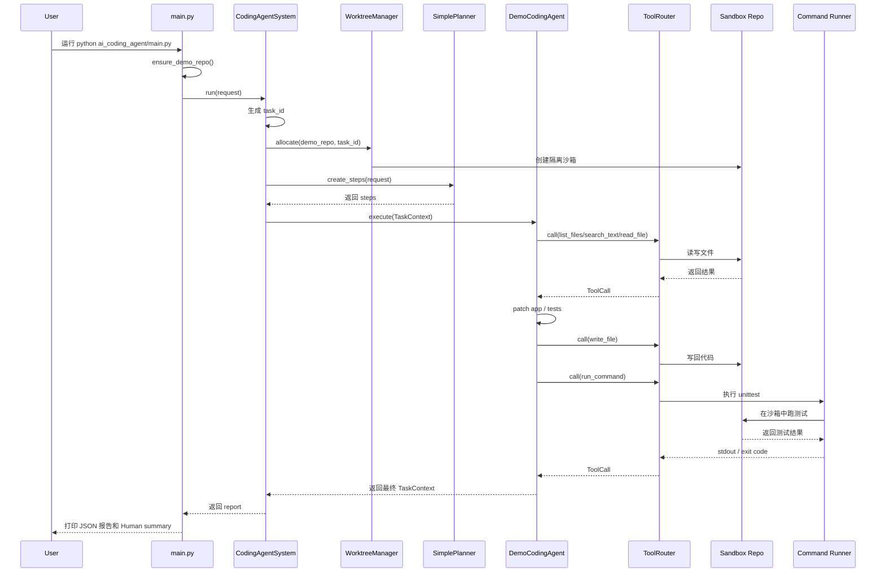

---
up:
related:
date: 2026-05-22
---

```mermaid
sequenceDiagram
    participant U as User
    participant M as main.py
    participant S as CodingAgentSystem
    participant W as WorktreeManager
    participant P as SimplePlanner
    participant A as DemoCodingAgent
    participant T as ToolRouter
    participant R as Sandbox Repo
    participant C as Command Runner

    U->>M: 运行 python ai_coding_agent/main.py
    M->>M: ensure_demo_repo()
    M->>S: run(request)
    S->>S: 生成 task_id
    S->>W: allocate(demo_repo, task_id)
    W->>R: 创建隔离沙箱
    S->>P: create_steps(request)
    P-->>S: 返回 steps
    S->>A: execute(TaskContext)
    A->>T: call(list_files/search_text/read_file)
    T->>R: 读写文件
    R-->>T: 返回结果
    T-->>A: ToolCall
    A->>A: patch app / tests
    A->>T: call(write_file)
    T->>R: 写回代码
    A->>T: call(run_command)
    T->>C: 执行 unittest
    C->>R: 在沙箱中跑测试
    R-->>C: 返回测试结果
    C-->>T: stdout / exit code
    T-->>A: ToolCall
    A-->>S: 返回最终 TaskContext
    S-->>M: 返回 report
    M-->>U: 打印 JSON 报告和 Human summary
```