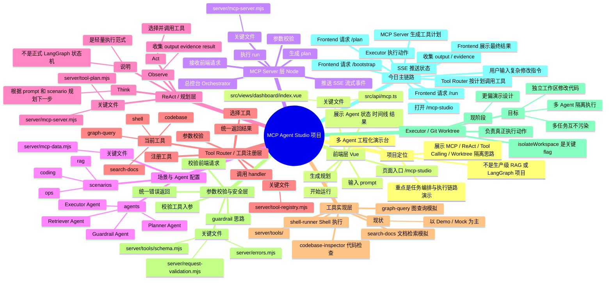

# MCP 项目脑图


---
excalidraw-plugin: parsed
tags:
  - excalidraw
---


# python

def build_prompt(question: str, scratchpad: str) -> str:  
    return f"""  
{SYSTEM_PROMPT}  
  
User question:  
{question}  
  
Current scratchpad:  
{scratchpad}  
""".strip()```


# python 1

```python
def build_prompt(question: str, scratchpad: str) -> str:
  return f"""
{SYSTEM_PROMPT}

User question:
{question}

Current scratchpad:
{scratchpad}
""".strip()
```


# python 2

```pthon
SYSTEM_PROMPT = """
You are a minimal Python agent.
Your job is to decide whether to call a tool or answer directly.

You must reply in JSON only.

If you need a tool, use:
{"type":"tool","tool_name":"get_time","tool_input":"..."}

If you can answer, use:
{"type":"final","answer":"..."}

Available tools:
1. get_time: Get the current local time.
2. read_knowledge: Read the local knowledge file for factual answers.
""".strip()
```


# python 3

```python
def run_agent(question: str) -> str:
    client = OllamaClient()
    scratchpad = "No tool has been used yet."

    for step in range(3):
        prompt = build_prompt(question, scratchpad)
        raw_reply = client.generate(prompt)
        action = extract_json(raw_reply)

        print("妯″瀷鍘熷杈撳嚭:", raw_reply)
        print("瑙ｆ瀽鍚庣殑鍔ㄤ綔:", action)
        if action["type"] == "final":
            return action["answer"]

        if action["type"] != "tool":
            raise ValueError(f"Unknown action: {action}")

        tool_name = action["tool_name"]
        tool_input = action.get("tool_input", "")
        if tool_name not in TOOLS:
            raise ValueError(f"Unknown tool requested: {tool_name}")

        observation = TOOLS[tool_name]["func"](tool_input)
        print("璋冪敤宸ュ叿:", tool_name)
        print("宸ュ叿杩斿洖:", observation)
        
        scratchpad = (
            f"Step {step + 1}\n"
            f"Tool used: {tool_name}\n"
            f"Tool input: {tool_input}\n"
            f"Observation: {observation}\n"
            "Now decide whether you should use another tool or give the final answer."
        )
    return "Agent stopped because it reached the max step limit."
```


# python 4

```python
def run_agent(question: str) -> str:
    client = OllamaClient()
    scratchpad = "No tool has been used yet."

    for step in range(3):
        prompt = build_prompt(question, scratchpad)
        raw_reply = client.generate(prompt)
        action = extract_json(raw_reply)

        print("妯″瀷鍘熷杈撳嚭:", raw_reply)
        print("瑙ｆ瀽鍚庣殑鍔ㄤ綔:", action)
```


# python 5

```python
class OllamaClient:
    def __init__(
        self,
        model: str = "qwen2.5:3b",
        base_url: str = "http://127.0.0.1:11434/api/generate",
    ) -> None:
        self.model = model
        self.base_url = base_url

    def generate(self, prompt: str, *, temperature: float = 0.2) -> str:
        payload: dict[str, Any] = {
            "model": self.model,
            "prompt": prompt,
            "stream": False,
            "options": {
                "temperature": temperature,
                "num_predict": 512,
            },
        }
        body = json.dumps(payload).encode("utf-8")
        http_request = request.Request(
            self.base_url,
            data=body,
            headers={"Content-Type": "application/json"},
            method="POST",
        )
        with request.urlopen(http_request, timeout=120) as response:
            data = json.loads(response.read().decode("utf-8"))
        return data["response"].strip()
```

# Excalidraw Data

## Text Elements
User ^uqs5u78h

Frontend ^FzTO3jkZ

MCP Server ^agzdKwOR

Planner Agent ^tP1L4Anm

ReAct Loop ^87O4LLZL

Tool Router ^Ztl1jPTw

Executor Agemt/Git worktree ^HeALoY78

%%
## Drawing
```compressed-json
N4KAkARALgngDgUwgLgAQQQDwMYEMA2AlgCYBOuA7hADTgQBuCpAzoQPYB2KqATLZMzYBXUtiRoIACyhQ4zZAHoFAc0JRJQgEYA6bGwC2CgF7N6hbEcK4OCtptbErHALRY8RMpWdx8Q1TdIEfARcZgRmBShcZQUebQBGAE5tAAYaOiCEfQQOKGZuAG1wMFAwMogSbggUmESAOQA2ADEAJS5+cthEKsDsKI5lYPSyyExuZ3iAdm0eAFYAFniAZhT4

niWGhpTNjsgYcfiF5Nn4+cntlZ4ADi2r3YgKEnVuObiGpMnZ7cn4hvmN+6SBCEZTSF4pOIrBb/eZXJaJS53YqQayDcSoFL3ZhQUhsADWCAAwmx8GxSFUcdZmHBcIFcsNyppcNg8cpcUIOMRiaTyRJKRxqbSclAGZAAGaEfD4ADKsCGEkEHlFEGxuIJAHUnpJuCltLMsTj8QhZTB5ehFZV7uzQRxwvk0HxkRA2DTsGp9mh4ilMU62cI4ABJYj21AF

AC69zF5GyQe4HCEUvuhE5WCquAAKsr2ZzbcwQ6URtB4OilsiAL5YhAIYjcSZLK5TRLzHjxe6MFjsLiexJtpisTh1ThibjxQ6JBqJX4NSZJ5gAEUyUGr3DFBDC900wk5AFFgtlciH44mnUI4MRcEua57JpNEjxJps60d7kQOHi4wn8C+2Czl2hV/gYTFBWxQFpAlQKgAjuqACapAAPIALJpPcXTohAvT9GiypjGgExXNolxLPMsKzNOSy3j2Toeqg

EzTrqKSzE23pbNOswzk6jzEM8DpXNMLYpHCDQ3EsSQNPqTpAiCYKemc2i3lc951g08IpJ8HGFqiZo+oWqpGtyZJVAAxDwYqJAgJHKkyLJ+hyXIkoZEhGfMKTYIxkzKhKUommaKokpaTp6RqWo6nqBpqsacroRaNZWsINp2i89wusy7ojt69y2YGwaFBGTpRrgMZXqgR5fk6ybEKmEi4AAqlmW7ELm+bIpAaHcKWIwgbpVbFf8fzzAiom9h2nAjkk

w39hwg4cMOskrIkkxnD8s4LsEl4rmuCAbg1u5ZMKIZFCMJQta1xYUlgIq7OUEHoEIkHMLMQiTFc2otWWyJ5YWp7nut163ve07PfW8wvsm75oKV36/sVAFAWUXXHYWN0QHdD1PS9yptXyF04dwVyzIRamCZsGz1hR9w0XR8QEZsELvHesIpEsSz3FxPGoLe2iJJOC31g+iSzKJjqFlJoIimg8wSZpAzaeF+kOby6BGfECAqyrVnMqy2b2TyxkuW57

GeZKMpRVUMXKkFCCatx2poLqUvlJbPnRf5sVOtakhNUlTopW6sDpTp5RZUGB2feUBVFR+x5IymuHoLVABq9V2V7EOfpWf6oI+PDvJMcwTZ2I7C+U7aTdNs2oIkDaCWs04rYumew1tTqbnZu37nkUdlV9Z4XpnUz/Q+z2KfMDRQwSMObahOMSDVYTklalDpjP6Bz0wnmcFA0qEEYJZj/lm9NIVko0Q7rUXQAgkQyhdugYi5Ovw1QOYBBXyCt8QPoJ

DEEM9x6LkuBkxMFjFBWCCFkLKjJCCZMBBl6YHFqveeypcBCCgGwFo4Qd7ohxEIZuhZXwIAABLAjFiOGYZ8pChDgVAAAMmDDagEEDAQ6GBCoxUIDEBoQAaQAIoIAAFIBgAFYACF0wNBqpISCkhpSYBoc4QkABxTGZ0JCYS0kge4ccoR6nHN6B8fxfhMRBtRA45F5LXEOC2POsxrisxCrxfiXohIiTEhQ0WMlUCnGmApJSpNEhqXYvcDROo5YEgMor

CAJkzIWXmBrGy2sIl61cu5I23lTYKldhbQ0wUbahQoU7DJ5oslxT8J7RKDpkqujSp6DKvp2TZVDpGaMCAQElXTuVWOaYk6lJzBU1AYFTrdDQB1eGGdipejmO8Jm6wC6jU9MROZU0hzoi9OOCiNxRz1zWo3KeLcdp7n2oUFqgyhnoSXPA0U112FNCMOmeCSwhF4gAFoQDeh9e430+4TJvHeIeTYBatidK+cG7To7lFJNDBh65JJUIunQt80KmFjNA

uVG5dyHlPNeahVR6ALmXSdNoic2hDGSwCQsRa+MNLlEpr8HgkIeABOWANdyzZ7F5M9ExBISQEQuUUkzNY7iSGeMlsEmW6JA4CByUSBWxk1aq00S3TWtlORJKcvrVJkZjbOzNiUwK0rrbs3tmEyKpoXZKlKQlPM3tCy+xqV4uphZg45TQOGZphVWnFUhp0yqccIC4ATso3pjV+neu6pnJlvN8YsydKXQuCylnl1WYxL4hj87lXnA3SejDtpt0OQeL

unze6/S8b8gGVwUiLE+OPXZOanT4qqE0XED9ORZiXivCATbN45DdoWMUm9t673avvPth9j74FPtPeBb8b5VHvkuBesamDP3cDOj+X9iA/0VYWf+UQgGkDaRw7hfDBGiPEZI6Rsj5FKMgaQaBHBYEdq7S23t5QUFoIwawIdaAcF4IhUA4h0kEHxHIYCOF8CEWgqbsw1FSN2GkCuFcaU8E1YNEIVwxRhIAAK2AYKKPTNgGAhIVHDPQOo8VuM0DvAaF

zQ4QN6wNkWEiQstLNgEVhOcZ6XwfiLGLpANmtteB8RmM4jYrjxxCqAyOOSvibz+MCdSlEFG7YmrVUrUy5lLIbmVYk2V6qUmGy1eks1uqLX6oioawTxrzNGh1ZkszhYPap14FU1K/tamSogM6pp+UWltLDddLp1V1TJz6datAgyiykdGWABGAgerDp4KsAFSyxpUULHGgcKzayjgFneOE2yEAlqbrmnc+bO6upOSdKL5ycZXXAuw6IRhiBcIoPBFo

byjrvRGGHSAXyS0Dz+cJSZswKEgsLcCn8E8kVgeYNQyDSKYNlFYcjJrLW2sdZxaR6AdXCXcFptoOEediL0uYg2CmZipipD4giKucxqZ1nZezHlhFpwIhOBWzYLkR3lA8Qg0VToQkqZs+EvTSt5Xq20wkhqamokasM/lbVRS/IOcdgahxGIwog9Nb5c2lrynhZcz7ap7mHWee87ld1kc07gvAkF+O6oenuwas5gL8XM5XG5oy2mFDMu32WIm7L3Zm

bMwbI9jNq0iu1phYWVuZW9oFpp93co/X+5lofA2ScTEa3Zpl50DtiFsOoGlEwdsbaKDUKqIbrDxvTePwPrkQde9Ixjq/hO7gFD8VrrncKe3GXl0v3wN7iQG6t3Kl3YA20B74OIeQ6h9DmGcN4YI0R2997H2XIkNb23pAzfBNQegzB37UC/tBraQDpDPSgdhXN+F9D/ybSW4ja5VR1i7kIUI/Azz4h1HYhwfQAZtwtDnPgRIF8SPoXI9hLR3AERxG

bFcJjlaSI50UxAVjnxDs8Elg2FSNwCucQx9cJxgkxMqTcYCYVwGZN3bkypAJ6kxXYWB7paVsPomabiVDrWMOwdw4Mx5EZibCZvZgFK/hZhjtZuAbZsjnjszmUs5nxs6CTjRF6OTg0iHJTr5h6v5h0jHL6mmAABqhYhqE6RZYyoAxZxYqgJZoA3AIg3jiRAr+4jT85DRLqsFJrcBnArAVrjQS5Zozb7J5oK4VahhVZHRnLnSXL1ZsIUhYbxA0LzAX

z96dadQfInjFpq6DzDZNjPRl6gps4QCQrTYN51oizga0L16oDQYorLZoryGKHKGqFba1YyF7ZoACzzB6h8SIaiTbCIYkQXZ4R0reHNjQiMpkR5zpblACYvDNiHY8zfD1iWLpoixX7cEUJA4YiqZ/7KwKqQ5KrQ52Tv7w6AGI7Ga456rQG5JGpY41E47mpgHlBOb9JIF2qk5oGZQYEuqhi9YQARyeoTb4FVTxyEFM6OYs6hp4GOy0G8CzCKRVw/Br

584jg/aQB85cGcqMqjjnAtiFbFZ7Ky4HKiGHgzF9ZaE/I6GLGLBjZTbS5/rnyZ7oBYb4DWBR6oAXzKDCjm6W4SCvHvFMCfHfH0gu6O5YLDpglQBHxu6Tr1qXzXwfzzp+4lwB6rqIlVCh6/xOgR77qHpt74Ad5d49594D5D4j5j5p7+AZ4IIQAAkcAfFfE/H54fpF7YKkC4Jl5EIZFV5pG/aWELZmFwyxYsIOESBCB1BQBCJEKWDqhNDzBih4jwRQ

AcAwDEDzCEKEIT49AIB9AhIz6ehzBLAJCKS1wbBbBVzrHr5mKb4jwLG/D1jCR8n8ZH7CYCQuLn4SaX5SayQ+K37KSqSP6A7KY5HY7v4aaxLxI/4lF5FlFpLAFVGo5SoQEcqY4FLSp2bFJJkYTxQE4hjtEoEBzdH+iYGur9GDG4G04VD07+owQkHObkG4pUHjIjhLDsRz70rMGomsFFxIGbFC6oANiL6jhnAUKECZo7K66PEQBy7EDtxHKVZHSnI1

bSEEqSFyESB8TwTzA0I0LPI0JqHwwaE9w/TaFDaLGfBdmQDjZK465CEWG14QbWG2EimwYt6bmTDbm7n7nanYzuGFhxxrBNjaD/ACzqThEthXnWkhENDb4gVzAr4CzTjXBWlxEOiVokp5b1ijhMwnBkTemV6oAA7SzP6hkNHv4Q7bqMg6a/66z6YGzlF9pI4gFZnNHJlGiWb5ImqZko5sU5kIFtGuZ+yoGOpBw9E+Z9p+ZernHVkEHVQwQTEtFTGE

5GFhD9x8SwVrDEQxEbF9jxpeIxosFlwDma7/CLSMQHEPGlZznlZnFVmq5XHnnwjiQmL4L3FTlTq0kYIXx9CoA0JsAui/EdreW+X+WBVQlO6QkO7QnjpwmFhe4YkSDImLosErqvyJXoBYlUWQC4lR6HoSlSkymEBykKlKkqlqkalanJR3rUn4B/HoAhVQB+UBVwDIIF6foQk/ocnTkEIV6eIgbOmUKPlWGIpCnIqvn2FwZVBCL6BwDqgICKJCLxCY

AXyaAQgwApBCABiSDblBr1q4oYS6lYTYkAUjjsQgYkTUx8TNg77kymIwV5xb6VpMSMr1hLFPaCbH4ian7CSeniQEX9U36KR36BlBLBmkWeaWzhkxJaZFHRmqqxkAHxk8VwENGcV2z1Fo4RQo3VFKUCWE4FluYiXoElm9FurYHU5grK505yXxzYrwFhbNRHQrkjLlgtl0EQjsRqTLQcGTTSYrF6VZYzSrJ76VrUz7ECGTn3mMgnEdwHQSHM0UE7b/

nM3IzPJQD4DxBCJYbphUDvI9ZFqnmOXlouS3EGHDEQruXS2QCSACnPmN52HN4NZVDq2a3a262/l4q7anWehbDTAkTMyjZtlkQMHBG0R0oXUthLBJbvBJAkTMaxFH6HAzBqRMregpALTiRWl/aZFP6yxhl5GUVRkqo6yORKxxlAE43ZmWzo1pncWwG42QCtEE1CX2pdH1Kk0SXhxSUW002jH+rPKKVN3KV2XU00GZzR337Dk6UMCC386uXdnGXC3c

EQhTAnCzKS1S4eXCHy5y290oyXEjjq7CSwgBKGWW1QpjWeVVDpgBX4CoAtDCALpBXPEQC30kgP1P0onigDqdWUFWn9q5Awknwe6eXB53y+4pXdlpVB4ZWfzfwnXlC5XALsIzVzULVLUrVrU8AbVbU7XzB7W2o1UwJ1Udrv332P2oLf3+rtVsncCl7AoAY8leLV4Pnzb22MJN4rbsItAiI1Tph1hCBGBYZtmBCQTOCSCEAtD8I8IAD6nth1epFGBp

XiiGNGxEJEXwFwcwiGYddEPwhECwzMt2Cwo2qFGO51hMjEbZGjxi2dzDpwyQLYfEOjZEokxFb6IZkNb+eREZsNsuNFMZdF5dSNldDd1d6OqZUBWNMBLFvFr6w9+N+ZrdnRolkAFOZZVOQxt5Pq/duAuA9Z/SjZ0WbNgUcxE4sFx+AtPZDozMguy96FhwKkbZG9SME5W91tM5stC54hS51WStDashyMxCF8/lMEz0h5sWx5Kuh9f055Pwjj5tOTbl

l9NhRx/Jw1gpaznDjt3DVQIzYzEzrhq5lGXiASNMYmCmCI2wSBrGSQMwJEmdo80RB+hYaFqAtiNGPwCxSWQskmhFHjSmENuRwTUSRd3+JdpRoTFRCZTRCTKokTdR6Z2N4TfFzdyTxORNRZHdp4pZfRWTlZY9FUeTmghTKlMlalxUQsNwPwfEqWnhUF/ZDTlBNwLk3ill29xxIhe9yzMzRtR91xCzA0d5V98Jr924mAupBepAwJWQUACgiiagqAFA

ZIeIOIVYL9tJErUraCMrTJ+g8rirTVKrpAargQ2VAxv9xeAI0VwD7uaAnuCJ78PuD8UDulpAMD4D8Dm6iDOVm8keKDVQvD/DgjwjojCA4jkj0jcjVJJD9VEA2r2A0rsrBrCrSrJrZrGrLJheX67JnJjD5eDjrDGz7Do12zwpCMezs8Pg8EuAbASwRgCjgzHhRFCR3opwOxo59KejdKDKTK2lrKSB7zpwhE3M3Mb1fwi+FE/zIqWRXjILZdYLBRFr

1k8NpdkSzk0LTFlRcL2SKZSL9dcTqNeNVqGLtqhZHmxZuLZN5ZPdvLfdfqAaQ9/FjN+9lLR9gkEI8IC09LlB9TFcvwXoksZEAum9JaDDXLu9PTRhDlArQ2t4ZKCd15Vtor8VHamrVQG84J1rADruIDDrYDcDyVyo7YnrcDWV4e/reJ7CnCvCAiwiYiEiUiMiciCihD5QUCtV8bbVrJub9D3VXJfVwGxbNtdtZbL53Wn0/qcAcAsofc3ABY0AQI2Q

VQ54prDIDAhACAFAIigTCNoLRk6d6dGnSbpAdIUAAYS4+gsoEUFFy7JnIg5nlnWQunxR+ni7m7DFDnZnwozn+gTQzFiZzREApnTnVnNnHFkBmNIXjnvn4XGZqLr6MXPnuQfnlDp7NqOVsXqXVn8EF7ZOHQyXYXWQTQeH9rHzhXoXcXJXVrzuxQRX1X+g1CXrwQYoa5WXKXFn8XtIUAF8ZnbAFAQIuA0l4KDXOXWQ24nIfXuIg3IQjW/XVAlX2XXX

WQ03A36YB12s3nxX/nLSj9ZoAWKo2AuIUoxBeE3MhEtxbZD4rwOcDsR3J3+AdZDoecNGvG/0o8QFTMhXRgAV+gCnsaBAuCoUWwLkTMTeY3K3+glDr7aiDUGnbIJAkV6FhXiPxAsoCArVBH9XaPiEbAlUk3uAmgwQnL6Td667APhYIiJI8GygTIAAFPWNQCy8z0z2mQAJTKgYLKAJi0g9B0+4D085zM/C+8Bjwc9qEIyQ8RcEh5fPycCj2FeDEYIp

h3oDCU/lA5BE8k/8f5s7pEBY8l4CdOgPoqddV68ceoIEK6/Tn6C0gEikB1Aeo2/3B2+mtMCE/E+Zy/oQ92DSl9DMDSgPpwB48E8Ppe+k/+p9CECMDkMa9SEKiZDR+jR/xCDYgGAbekZGEmFWW+YGAm7BDJ+3wlbAqhC9fR+x931dwQ+ODMDa8yoPzwKIQ5BCCLYTUDGSjhAKfvRlhAA=
```
%%
