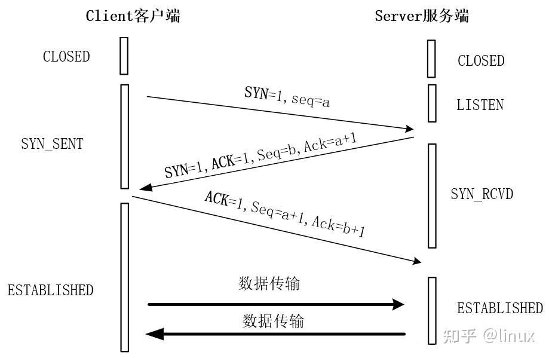
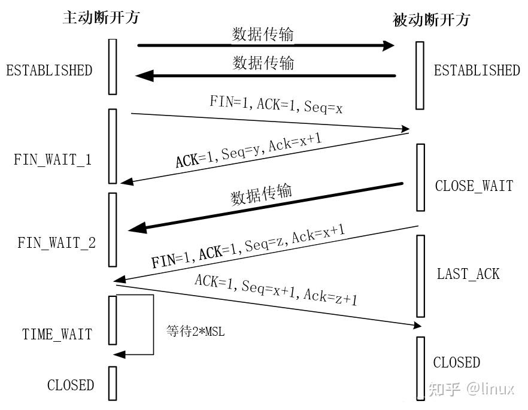

TCP连接的建立时，双方需要经过三次握手,
1. C端进入SYN_SENT状态，发送一个SYN帧主动打开传输通道，该帧会附带SN（seq，发送端的序号用于确认）和MSS（最大报文字段）告知S端
2. S端接收到SYN帧后进入 SYN_RCVD状态，并返回**SYN+ACK**帧，同时附带SN（seq）和AN（Ack，下一次别人要发的序号）SYN+ACK帧的MSS（最大报文段长度）表示的是S端的最大数据块长度。
3. C端接收到**SYN+ACK**帧后进入ESTABLISHED状态，进入发送状态，并发送一个ACK帧附带SN，AN信息。
4. S端接收到ACK帧进入ESTABLISHED状态双方连接建立

TCP连接的断开时，双方需要经过四次握手。
1. 

